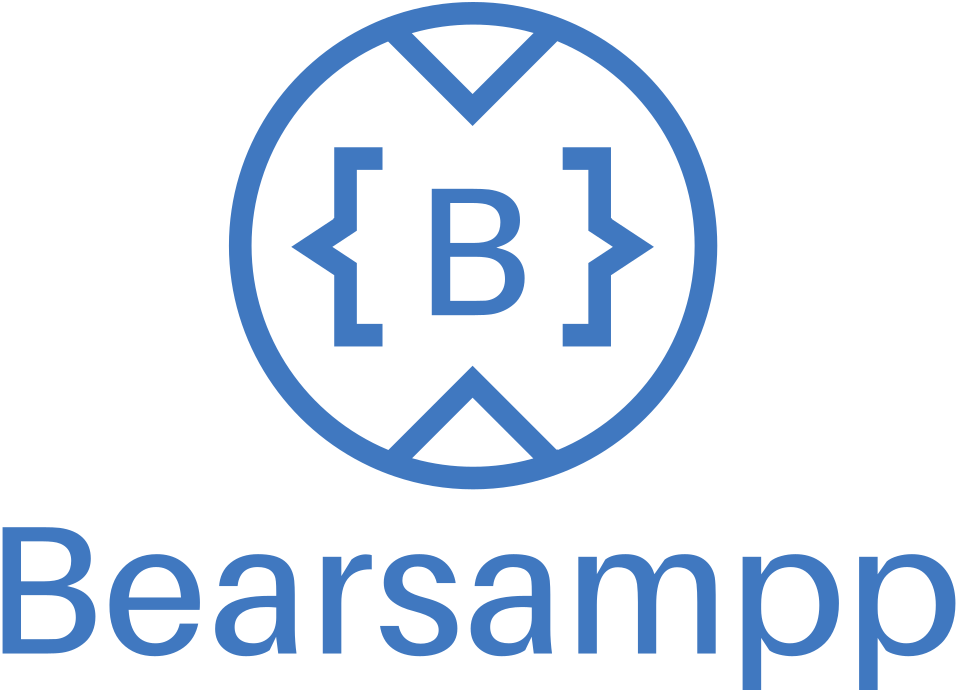
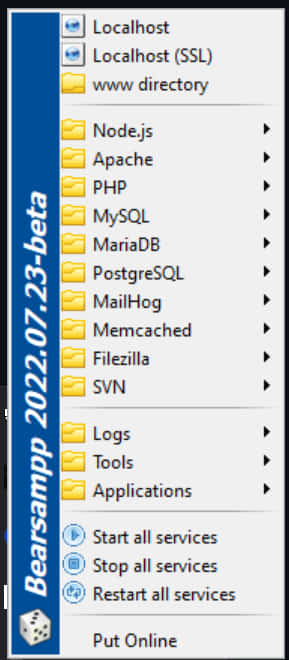
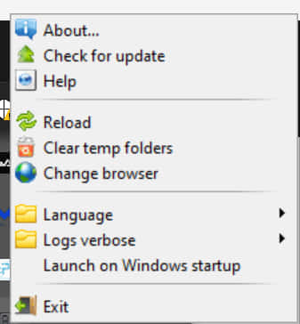
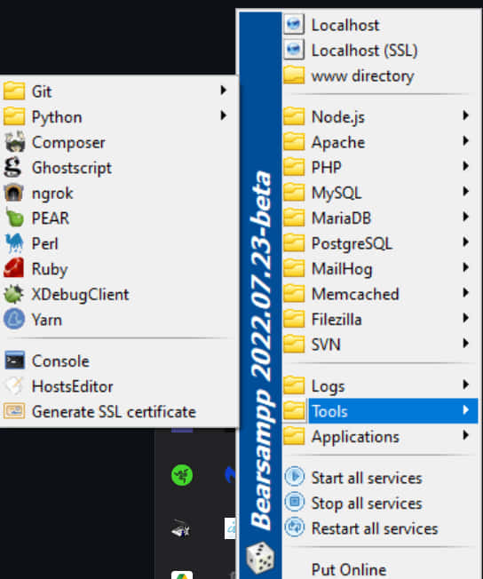

  
  
   
  

## About

**Bearsampp** is a portable WAMP software stack involving useful binaries, tools and applications for your web development.

 

It also offers several versions of the various [modules](https://bearsampp.com/module) for download on the
[official website](https://bearsampp.com) and many other features. 

For those who wish to contribute, have an issue or questions, read the [Documentation](https://bearsampp.com/documentation).

### Modules

|  <h3>Type</h3> | <h3>Description</h3>|
| ------------------ | -----------------------------------------------------------------------------------------------------------------|
|  | [Adminer](https://bearsampp.com/module/adminer): a full-featured database management tool written in PHP. |
|  | [Apache](https://bearsampp.com/module/apache): the world's most used web server software. |
|  | [Composer](https://bearsampp.com/module/composer): a dependency manager for PHP. |
|  | [ConsoleZ](https://bearsampp.com/module/consolez): modified version of Console 2 for a better experience. |
|  | [Filezilla](https://bearsampp.com/module/filezilla): a FTP server application. |
|  | [Ghostscript](https://bearsampp.com/module/ghostscript): an interpreter for the PostScript language and for PDF. |
|  | [Git](https://bearsampp.com/module/git): a widely used version control system for software development. |
|  | [MailHog](https://bearsampp.com/module/mailhog): a Web and API based SMTP testing. |
|  | [MariaDB](https://bearsampp.com/module/mariadb): a community-developed fork of the MySQL relational database management system. |
|  | [Memcached](https://bearsampp.com/module/memcached): a distributed memory object caching system. |
|  | [MySQL](https://bearsampp.com/module/mysql): an open-source relational database management system. |
|  | [ngrok](https://bearsampp.com/module/ngrok): secure tunnels to localhost. |
|  | [Node.js](https://bearsampp.com/module/nodejs): an open-source, cross-platform runtime environment for developing server-side web applications. 
|  | [Perl](https://bearsampp.com/module/perl): a family of high-level, general-purpose, interpreted, dynamic programming languages. |
|  | [PHP](https://bearsampp.com/module/php): a server-side scripting language designed for web development including PEAR and extra extensions. |
|  | [phpMyAdmin](https://bearsampp.com/module/phpmyadmin): to handle the administration of MySQL and MariaDB over the Web. |
|  | [phpPgAdmin](https://bearsampp.com/module/phppgadmin): a web-based administration tool for PostgreSQL. |
|  | [PostgreSQL](https://bearsampp.com/module/postgresql): an object-relational database management system (ORDBMS). |
|  | [Python](https://bearsampp.com/module/python): a widely used high-level, general-purpose, interpreted, dynamic programming language. |
|  | [Ruby](https://bearsampp.com/module/ruby): a dynamic, reflective, object-oriented, general-purpose programming language. |
|  | [Webgrind](https://bearsampp.com/module/webgrind): the Xdebug Profiling Web Frontend in PHP. |
|  | [XDebugClient](https://bearsampp.com/module/xdc): a simple frontend for XDebug. |
|  | [Yarn](https://bearsampp.com/module/yarn): a fast, reliable, and secure dependency management. |

## Documentation

* [Get started](https://bearsampp.com/get-started)
* [Screenshots](https://bearsampp.com/screenshots)
* [FAQ](https://bearsampp.com/faq)
* [Upgrade notes](https://bearsampp.com/upgrade)
* [Reporting an issue](https://github.com/Bearsampp/Bearsampp/issues)
* [Request a module](https://bearsampp.com/request)
* [Contribute](https://bearsampp.com/contribute)
* [Translations](https://bearsampp.com/translations)

## Contributing

Want to contribute? Awesome! The most basic way to show your support is to star the project, or to raise issues. If
you want to open a pull request, please read the [contributing guidelines](.github/CONTRIBUTING.md).

You can also support this project by [**becoming a sponsor on GitHub**](https://github.com/sponsors/N6REJ) or by
making a [Paypal donation](https://www.paypal.me/BearLeeAble) to ensure this journey continues indefinitely!

Your always welcome to join the [project team](https://github.com/orgs/Bearsampp/teams) to help insure the longevity of the project.
Thanks again for your support, it is much appreciated! :pray:

## Supporters

We would like to thank the following for supporting our project:

[N6REJ](https://github.com/N6REJ)

## License

GPL-3.0. See `LICENSE` for more details. 

<h6>Bearsampp was originally forked, in 2021, from neard.io</h6>
