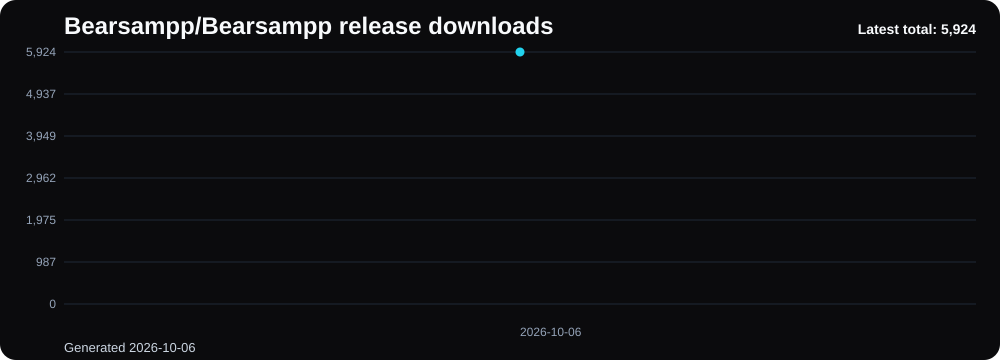
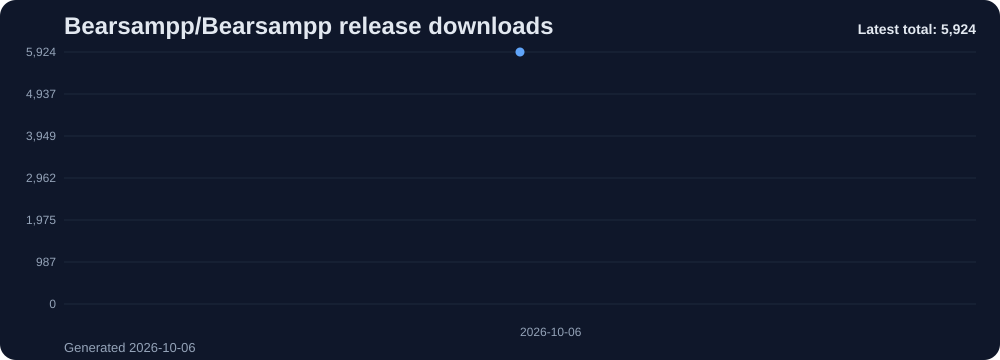
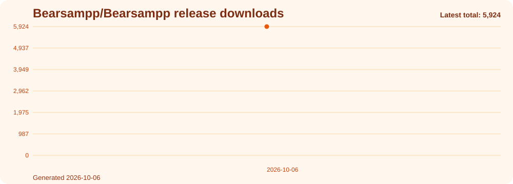
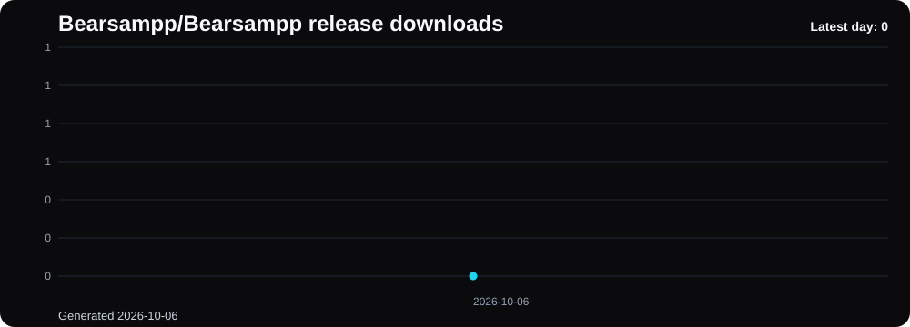
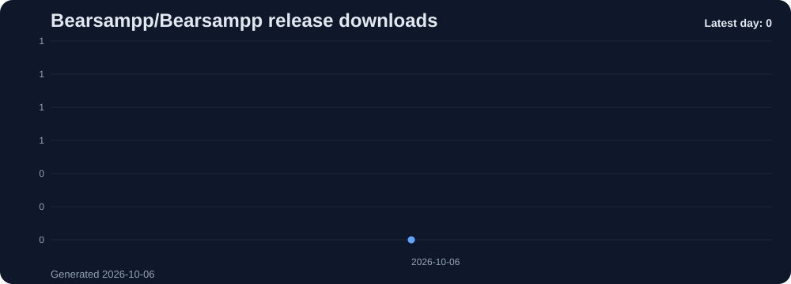
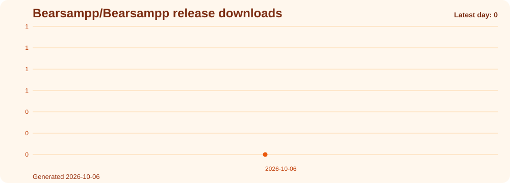
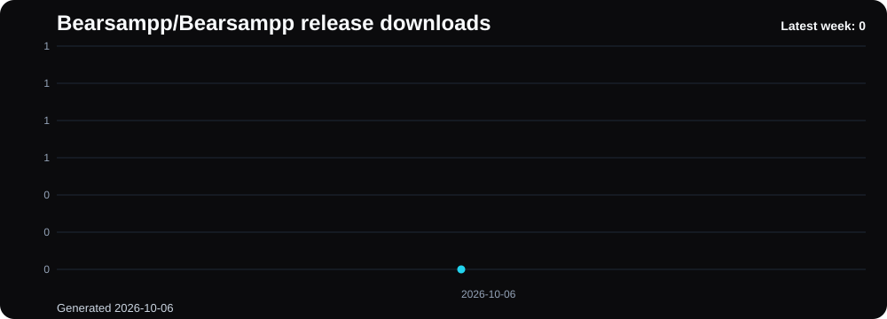

# Bearsampp Downloads

Release asset download totals for [Bearsampp](https://github.com/Bearsampp/Bearsampp), tracked daily by [GitHub Downloads Action](https://github.com/justagwas/github-downloads-action).

## Total downloads trend

## Chart variants

The action generates every chart in three themes. Swap the file name to change theme: `charts/<type>--<theme>.svg`.

### total-trend

| black | slate | orange |
|:---:|:---:|:---:|
|  |  |  |

### daily

| black | slate | orange |
|:---:|:---:|:---:|
|  |  |  |

### weekly

| black | slate | orange |
|:---:|:---:|:---:|
|  |  |  |

### monthly

| black | slate | orange |
|:---:|:---:|:---:|
|  |  |  |

## Data

Raw snapshot data lives in [`downloads.json`](downloads.json).

| Field | Value |
|---|---|
| Repository | `Bearsampp/Bearsampp` |
| Update mode | daily |
| Window | 45 days |
| Snapshots collected | 1 |
| Day / week / month | partial — not enough history yet |

`day`, `week`, and `month` stay flagged partial until the action has collected enough daily history to compare against. Expect roughly a week before weekly comparisons become meaningful and a month before monthly ones do.

## Notes

Repository copies, page views, and automatically generated source archives are not counted. Only files attached to GitHub Releases are included.

Badges are served by [shields.io](https://shields.io) and cache for 15 minutes, so they can lag the snapshot by up to that much. The charts below are regenerated by the workflow and are never cached.